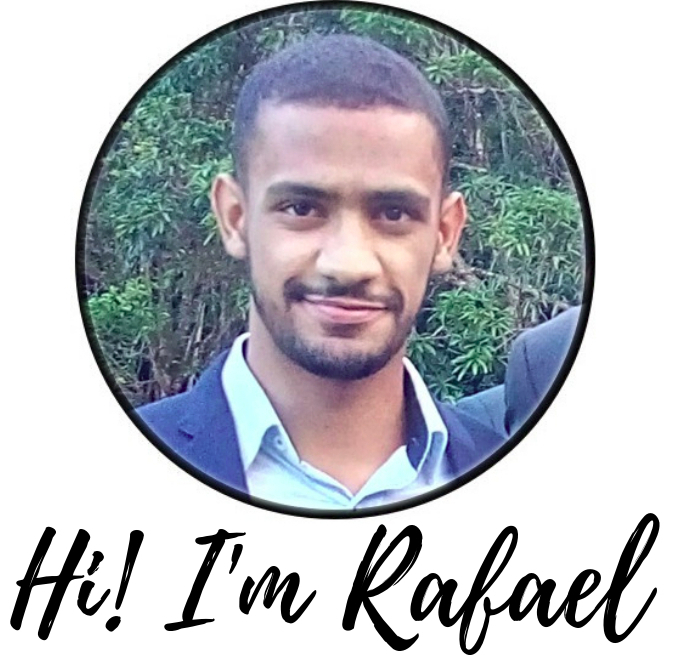

---
# Feel free to add content and custom Front Matter to this file.
# To modify the layout, see https://jekyllrb.com/docs/themes/#overriding-theme-defaults

layout: aboutme
title: "About Me"
---

I am a **Control and Automation Engineering student** at [**Federal University of Minas Gerais**](https://ufmg.br/international-visitors), Brazil.  
Currently engaged as **Research & Development Intern** at [Concert Technologies](http://www.concert.com.br). Member at **Autobotz UFMG**, robotics competition team from [**MACRO (Mechatronics, Control and Robotics)**](http://macro.ppgee.ufmg.br/).  
• **Main interests:** robotics, hardware description and IA.

## Timeline
**2018**  
I started working at [**Concert Technologies**](http://www.concert.com.br) as a research & development intern, working on innovative projects related to distributed energy storage, transmission and fault location.  
**2016**  

1st and 2nd place on **Campus Party MG** competition
I started working at Autobotz, robotics competition team from [**MACRO (Mechatronics, Control and Robotics)**](http://macro.ppgee.ufmg.br/) laboratories at [UFMG](https://ufmg.br/international-visitors).  
The main projects I was involved was a high performance line following robot, mechanical and electronic design for an autonomous boat robot and navigation algorithms for an autonomous vehicle targeted to [Robocup Junior Rescue Competition](http://www.robocup2016.org/en/leagues/robocupjunior/rescue/) based challenge.  
Also, I presented a lecture called [**MACRO - Mecatrônica, Controle e Robótica**](https://youtu.be/1u-GuFnk6ME), telling about the Autobotz robots and projects developed by our team.
